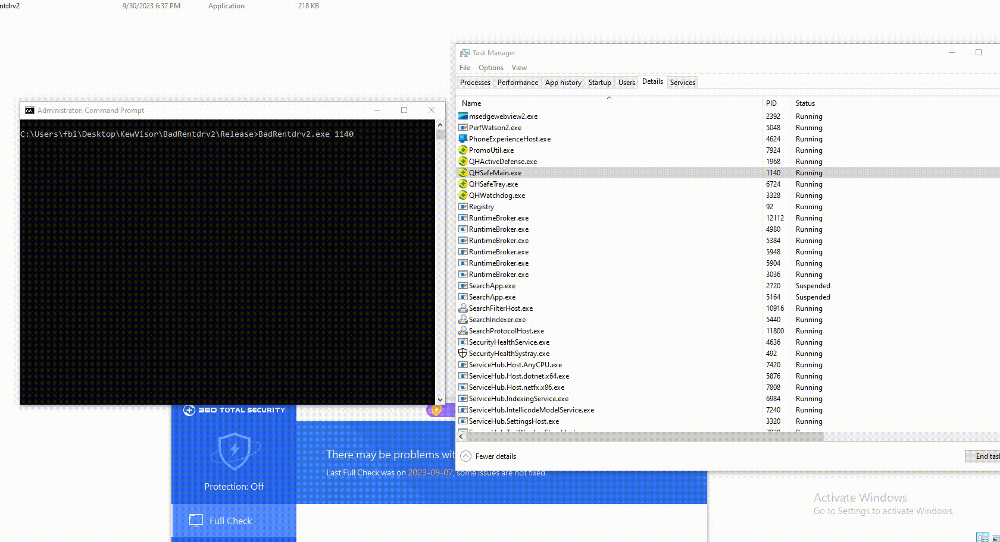
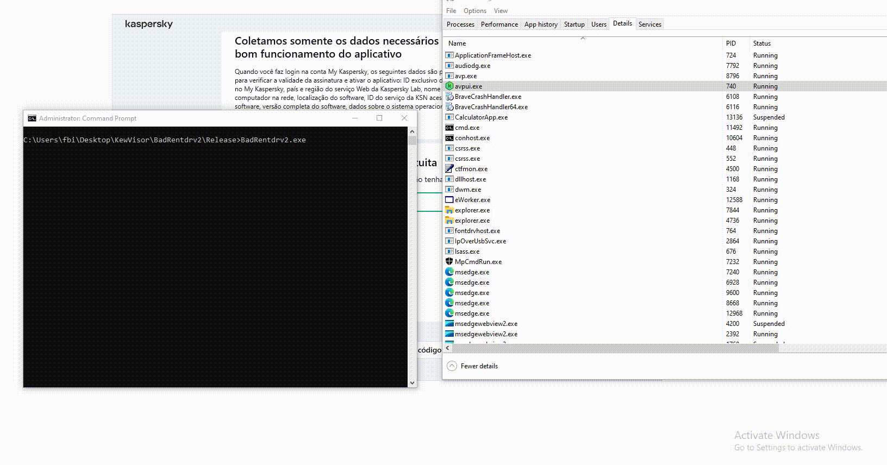
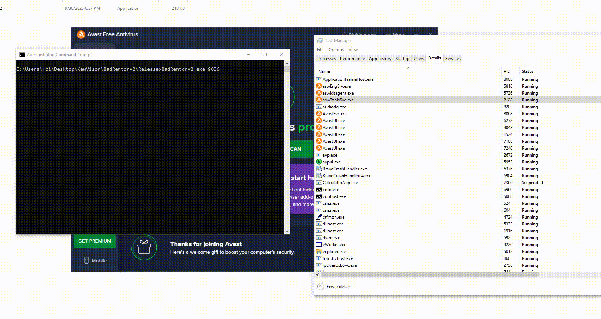
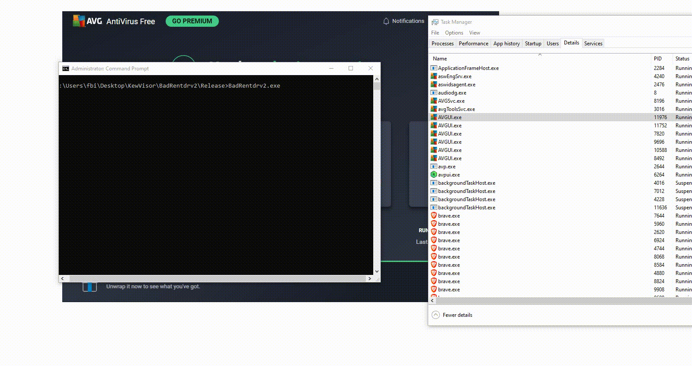
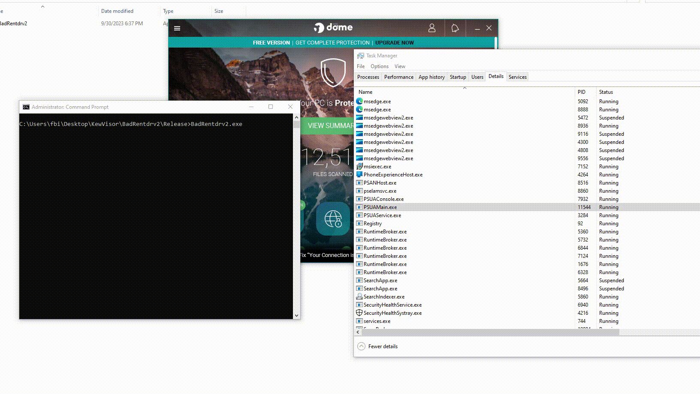
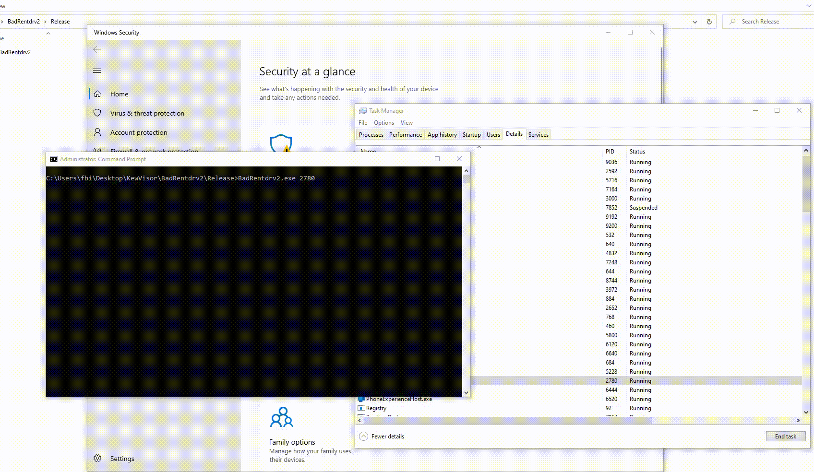

# BadRentdrv2

A vulnerable driver exploited by me (BYOVD) that is capable of terminating several EDRs and antivirus software in the market, rendering them ineffective, working for both x32 and x64.

## How does it work?

Compile targeting the legacy x32 architecture for a wider attack range.

In an elevated command prompt(Admin), use the following command line:
```
BadRentdrv2.exe <PID>
```
This will terminate the protected process without any difficulty.

Note: In this proof of concept, I have only programmed it to terminate the process using the PID. It supports other methods such as terminating by the process name and terminating the process and its child processes by the parent process name. To do this, simply make a small modification, and it will work. Please read the proof of concept code to understand.

## Tests on the most well-known security systems in the market:

#### 360 Antivirus



#### Kaspersky Antivirus



#### Avast Antivirus



#### AVG Antivirus



#### Panda Antivirus



#### Windows Defender



## Driver Hash

I published the vulnerability because I was unable to contact the developer company to report it

## Timeline
- Contact #1(Without response).
- Contact #2(Without response).
- Notified to Mitre about the lack of contact with the company and CVE issued to attempt contact.
- Contact #3 (Sent a last e-mail with the CVE number, with 14-days to response).
- Published(Without response).
- Some idiots from APT used it into malware's(on the same day i published) - Explained with a very cool article by [Unit42-Team](https://unit42.paloaltonetworks.com/agonizing-serpens-targets-israeli-tech-higher-ed-sectors/)(and their team have my respect because investigate and appoint it as a vulnerabilty on the driver too).
- An notification was sent to Microsoft's threat intelligence team.
- Microsoft send back an email thanking about the report.
- Driver and Company Account got blocked by Microsoft Threat Intelligence Team.
- Published on the "Microsoft recommended driver block rules".
- I didn't publish the CVE because the company didn't respond me and not like to force publication.

rentdrv2_x32 - 1aed62a63b4802e599bbd33162319129501d603cceeb5e1eb22fd4733b3018a3

rentdrv2_x64 - 9165d4f3036919a96b86d24b64d75d692802c7513f2b3054b20be40c212240a5
